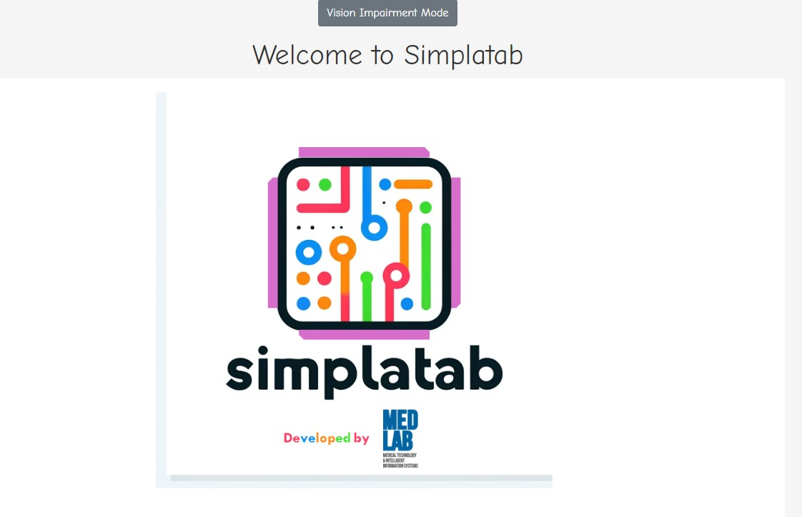
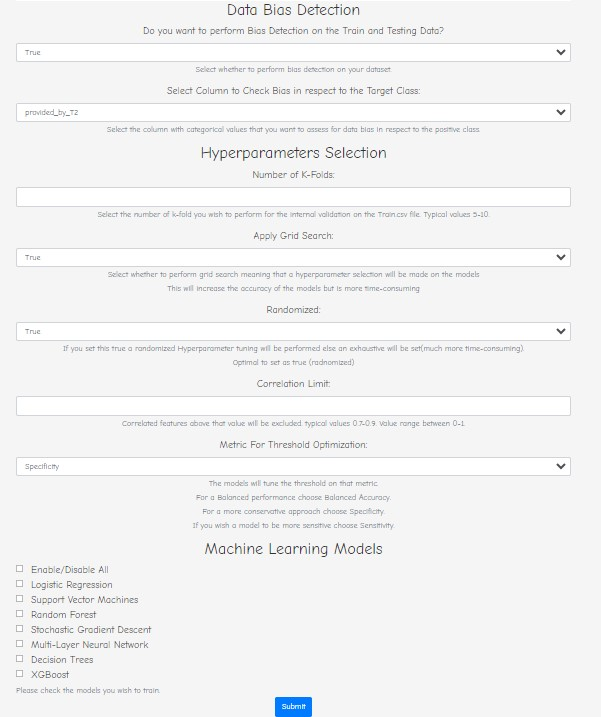

# SIMPLATAB: **SI**mplified **M**achine **P**ipe**L**ine **A**utomator for **TAB**ular data

## Overview
Simplatab is a comprehensive machine learning pipeline designed to automate the process of data bias detection, training, evaluation, and validatiion of typical ML classification models bundled with XAI shap analysis. It provides a robust framework for bias detection, feature selection, preprocessing, hyperparameter tuning, model evaluation, and XAI analysis ensuring efficient and accurate model performance.

## Contents
- [Context](#context)
- [Requirements](#requirements)
- [Desktop EXE app](#Run-as-Desktop-app)
- [Docker Run](#Run-as-Docker-Image)
- [Python App](#Run-as-Python-API)
- [Data Requirements](#requirements-for-the-Data)
- [Inputs](#inputs)
- [Outputs](#outputs)
- [Main Advantages](#main-advantages)
- [Key Concepts](#key-concepts)
- [Feature Selection](#feature-selection)
- [Preprocessing](#preprocessing)
- [Hyperparameter Tuning & Training](#hyperparameter-tuning--training)
- [Evaluation](#evaluation)
- [Testing on the External Set](#testing-on-the-external-set)

## Context
Simplatab framework runs a complete Machine Learning Pipeline from **Data Bias assessment** to **model train** and **evaluation** and **XAI analysis** with Shap, for a variety of selectable models.
Please navigate to the [Examples Folder](Example) where examplars Train.csv and Test.csv are given along with the outcomes after the execution of the tool

## Requirements
- **Python 3.x** for the Python API
- **Docker (for Docker version)** for the Docker API and the .EXE
- **Required Python Libraries**: `scikit-learn`, `pandas`, `numpy`, `matplotlib`, `xgboost`, `shap`, `featurewiz`

## Run as Desktop app
Download the Desktop app from [here](Simplatab-Setup-1.0.0.exe)
1. Run the .Exe to install it  
2. Open Docker Desktop  
IMPORTANT NOTE. You need to have docker desktop installed on your PC    
Download it from here   
[Docker](https://www.docker.com/products/docker-desktop/)

There you need to define input folder with the data (Read [Data Requirements](#requirements-for-the-Data)) and the output folder which will be empty

## Run as Docker Image
You can pull Directly the Docker Image as   
```bash
docker pull dimzaridis/simplatab-machine-learning-automator:1.0.0-TestVersion
```
and run the docker image as  
```bash
sudo docker run -p 5000:5000 -v /absolute_path/to/your/input_data:/input_data  
                -v /absolute_path/to/your/Empty/Folder/For_the/outcomes/to_be/stored:/Materials  
                dimzaridis/simplatab-machine-learning-automator:1.0.0-TestVersion (or latest)
```
When the docker is started go to 
```bash
localhost:5000
```
open a browser (Mozilla/Chrome) and type the above url

A page like the following should be open. There configure what are the elements you desire to run.  
For Instance if you want to perform Bias assessment, How many folds to run for the internal k-fold cross-val
and what models you wish to run




## Run as Python API
1. Clone the repository to the desired folder  
```bash
git clone https://github.com/dzaridis/SIMPLATAB.git  
```
2. Place your Train.csv and Test.csv into a folder  

3. Create a "Materials"folder in the repository workspace  

4. Install the requirements  
```bash
pip install -r requirements
```
5. Run the python API
```bash
python __main__.py 
```

6. An interactive window to select you folders will be opened. Select input folder and the "Materials" folder you previously created as the output folder  
```bash
python __main__.py 
```

7. Follow the steps in the interactive session to fill in the parameters such as k-fold, grid-search (they are simple just true/false values)

8. Wait for the execution to finalize

### Requirements for the Data
```bash
1. The input folder must contain a Train.csv and a Test.csv files  
2. The **CSVs** MUST not contain missing values  
3. The target column should be   
   a. **BINARY** with values **0 and 1** for both Train and Test.csv  
   b. it should have the name **Target**  
4. Train.csv and Test.csv should contain a column named **"patient_id"** or **"ID"** which is the id for a given row
```
## Inputs
- **CSV Files**: Must not contain missing values.
  - **Train.csv**: Features and target (last column). Used for K-Fold cross-validation and threshold tuning.
  - **Test.csv**: Features and target (last column). Used for validation of thresholds, metrics, ROC curves, and SHAP analysis.

For the Docker version, place `Train.csv` and `Test.csv` in an input volume folder.

## Outputs
The outputs will be saved in the `Materials` folder (or a specified output volume for Docker version):
- `ROC_CURVES.png`: ROC curves for each algorithm on the test set.
- `Precision-Recall curves.png`:Precision-Recall curves for each algorithm on the test set.
- `ShapFeatures` folder: A ShapFeatures folder will be created, Inside model subfolders will be created which contain 3 kind of plots  
    - `Summary Plot`: Top 10 features and their impact on model output
    - `BeeSwarm Plot`: Similar to summary plot but also takes into account the sum of the shap values for all features not just the top 10
    - `Heatmap Plot`: Contains information regarding the impact of each feature (top 10 and the rest as a sum) and how they impact the probabilities of the model's outcome
- Excel files:
  - Metrics for the algorithm on the internal K-Fold.
  - Metrics for the algorithm on the external set.
- `Models` folder: Pickle files containing the models evaluated on the external data. These pipelines can be used directly without manual feature selection or preprocessing.
- `Confusion_Matrices` folder: The confusion matrices for each model on the internal k-fold (mena values of tp, fp, tn , fn) and external set are provided as images

## Main Advantages
- Data Bias Detection
- Automated feature selection & preprocessing.
- K-Fold Stratified Cross-validation on `Train.csv`.
- Automated threshold calculation based on validation splits from K-Fold.
- Hyperparameter tuning on the stratified K-Fold.
- Testing on `Test.csv` with the best hyperparameters from the internal K-Fold and the average threshold across folds.
- Reporting of five metrics on both the internal K-Fold and external set (`Test.csv`):
  - AUC
  - F-Score
  - Accuracy
  - Sensitivity
  - Specificity
  - Balanced Accuracy
- ROC and PR Curves
- SHAP Analysis on the external set to identify significant features for Model's Outcomes.

Shap Analysis consists of 3 plots (summary plot, beeswarm, heatmap)

## Key Concepts
- **Data Bias Detection**: User sets a column of his data to check whether there is a bias in respect to the Target column
- **Hyperparameters**: Set before training to control the behavior of the training algorithm.
- **Cross-validation**: Evaluates model performance by splitting data into multiple folds and training/testing on different combinations.
- **Pipeline**: A sequence of data processing and model training steps applied consistently across all models.
- **XAI Analysis** with Shapley Library

## Feature Selection
Identifies and retains important features based on correlation. Supports various strategies:
- **featurewiz** (Default): Based on correlation matrix and XGBoost selection.
  - `corr_limit` (default: 0.6)
- **rfe**: Recursive Feature Elimination using logistic regression.
  - `n_features_to_select` (default: 5)
- **lasso**
- **random_forest**: Based on correlation matrix and XGBoost selection.
- **xgboost**: Based on correlation matrix and XGBoost selection.

## Preprocessing
Prepares data for training:
- **Tabular Data**: One-hot encoding.
- **Numeric Data**: Z-Score normalization.

## Hyperparameter Tuning & Training
- **Hyperparameter Tuning**: Uses exhaustive grid search to find the best hyperparameters.
- **Training**: Trains the model on the training data.

## Evaluation
- **Threshold Optimizer**: Finds the optimal threshold on the train set for each fold based on the AUC metric.
- **Metrics**: Evaluates the model on validation data on each fold using:
  - AUC
  - F-Score
  - Accuracy
  - Sensitivity
  - Specificity
  - Balanced Accuracy

## Testing on the External Set
- **Retraining**: Models are retrained on the entire `Train.csv` dataset with hyperparameters set based on K-Fold selection.
- **Threshold**: Set as the average of the thresholds from the K-Fold.
- **Metrics**: Computed on the `Test.csv` for the optimal threshold.
- **Shapley Analysis**: Performed on a fraction of the test set (up to 100 instances).
- **ROC Curves**: Reported for each algorithm on the testing dataset.


## Authors
Main Work Implemented by:  
- **Dimitrios Zaridis** (corresponding), M.Eng, PhD Student @ National Technical University of Athens
- **Eugenia Mylona**, Ph.D
- **Vasileios B. Pezoulas**, Ph.D

Assistance by:  
- **Charalampos Kalantzopoulos**, M.Sc
- **Nikolaos S. Tachos**, Ph.D
- **Dimitrios I. Fotiadis**, Professor of Biomedical Technology, University of Ioannina


